# 

 

# 🔍 Sobre

Repositório de documentação do projeto StressLab, trabalho final do semestre (A3) da disciplina de Gestão e Qualidade de Software da Unisociesc 2024/02.

A ideia do projeto foi simular um ciclo completo de testes de software, abrangendo desde o planejamento até a analise e conclusão dos testes. 

 

---

# 🚀 Tecnologias

  <table>
    <tr>
        <th style="text-align: center;">Word</th>
        <th style="text-align: center;">Cypress</th>
        <th style="text-align: center;">Jmeter</th>
        <th style="text-align: center;">Trello</th>
    </tr>
    <tr align="center">
      <td>
        
      </td>
      <td>
        
      </td>
      <td>
        
      </td>
      <td>
        
      </td>
    </tr>
  </table>

 

---

# ❗Pré requisitos

É de extrema importância que já tenhas instalado as seguintes ferramentas no seu ambiente de trabalho, para o projeto funcionar normalmente:

1. [Node.js](https://nodejs.org/pt): Versão 16 ou superior.
2. [Java](https://www.java.com/pt-BR/): Versão 8 ou superior (necessário para executar o JMeter).
3. Ferramentas Instaladas:
   - [Cypress](https://www.cypress.io/)
   - [JMeter](https://jmeter.apache.org)
4. Navegador: [Chrome](https://www.google.pt/intl/pt-PT/chrome/), [Edge](https://www.microsoft.com/pt-br/edge/download) (ou outro compatível com o Cypress).

 

---

# 📘 Do by yourself

1. Cypress

    1. Para rodar os testes, use o terminal e navegue pela pasta [StressLab
/2-Automacao_com_Cypress](./2-Automacao_com_Cypress). Podes usar o seguinte comando para isso:

    ~~~bash
    cd .\2-Automacao_com_Cypress\
    ~~~

    2. Então, execute o seguinte comando:

    ~~~bash
    npx cypress open
    ~~~

    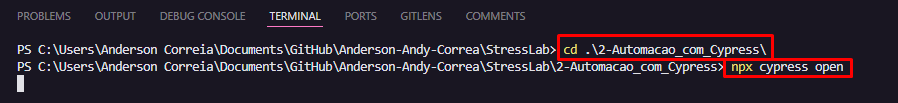

    3. Deve abrir a página inicial do Cypress, então selecione a opção E2E Testing,conforme a imagem abaixo.

    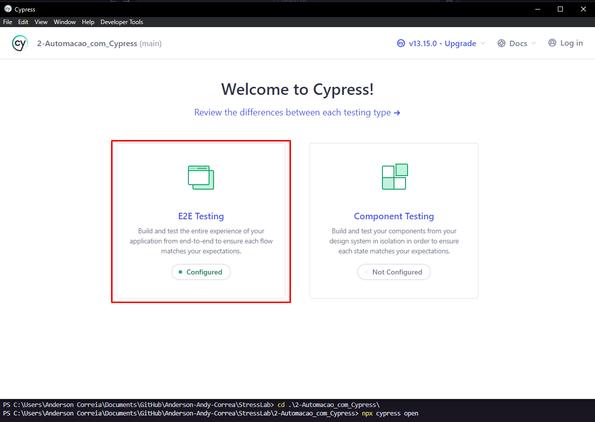

    4. Escolha o navegador de sua preferência e clique no botão marcado. (Recomendo usar o Chrome)

    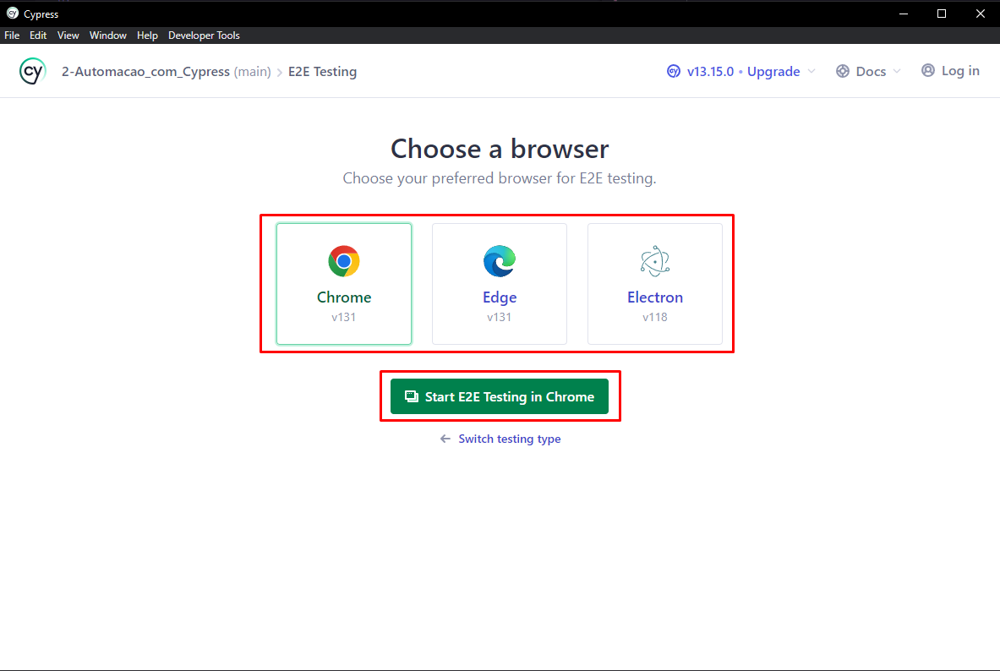

    5. A página principal do projeto deve abrir e já aparecer algumas Specs. A principal é a Testes_críticos.cy.js, clique nele e deve começar a mostrar os testes em execução.

    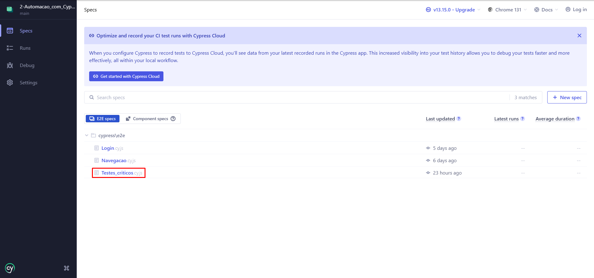

    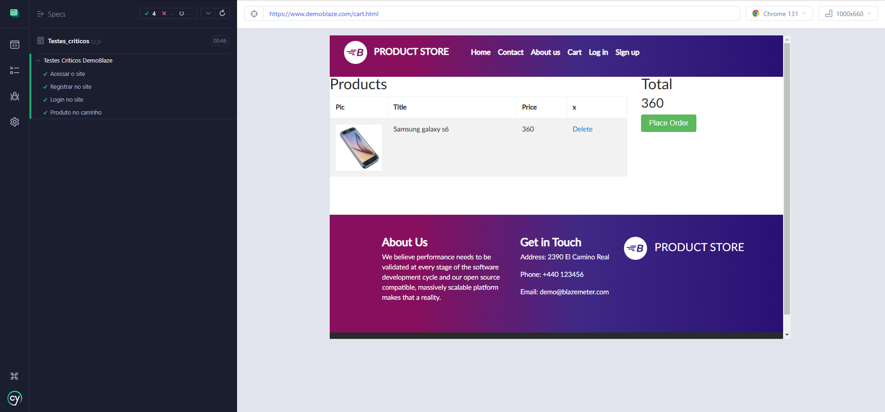

  

2. Jmeter

    1. Para rodar os testes, navegue pela seguinte pasta do projeto:

    [StressLab/3-Testes_Nao_Funcionais_com_Jmeter/apache-jmeter-5.6.3/bin](./3-Testes_Nao_Funcionais_com_Jmeter/apache-jmeter-5.6.3/bin).

    2. Nessa mesma pasta, execute o inicializador do Jmeter [ApacheJMeter.jar](./3-Testes_Nao_Funcionais_com_Jmeter/apache-jmeter-5.6.3/bin/ApacheJMeter.jar). 

    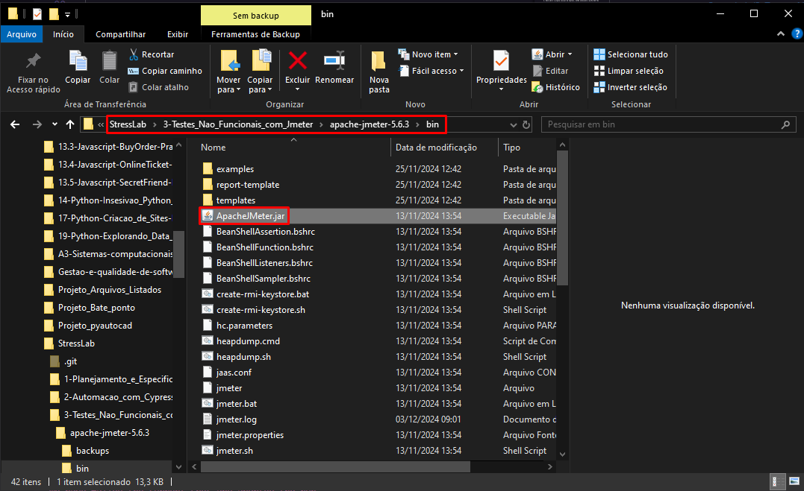

    3. Deve carregar o iniciador do programa dessa forma:

    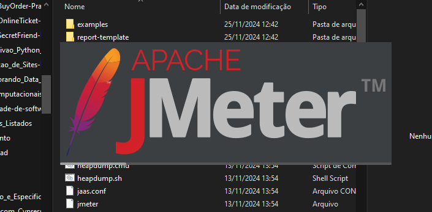

    4. A página inicial deve aparecer em poucos segundos, após isso, na aba arquivo (file), selecione a opção abrir (open).

    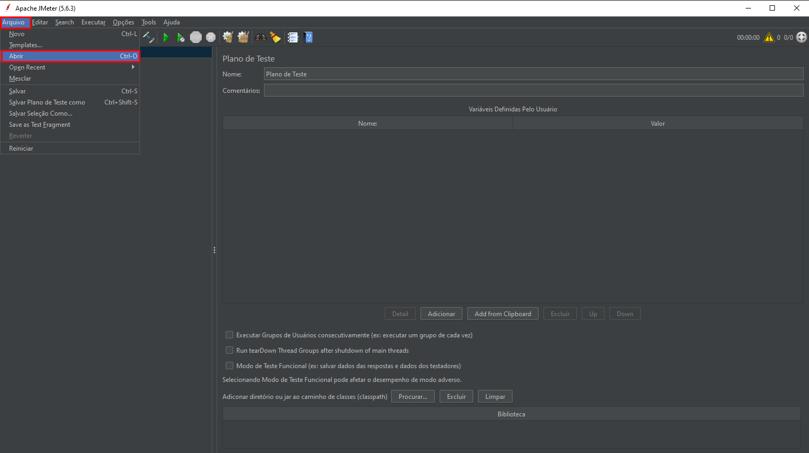
    
    5. Navegue pela seguinte pasta do projeto:

    [StressLab/3-Testes_Nao_Funcionais_com_Jmeter](./3-Testes_Nao_Funcionais_com_Jmeter)

    6. Selecione o arquivo do projeto do Jmeter [Teste Damoblaze.jmx](./3-Testes_Nao_Funcionais_com_Jmeter/Teste%20Damoblaze.jmx) e abra o arquivo.

    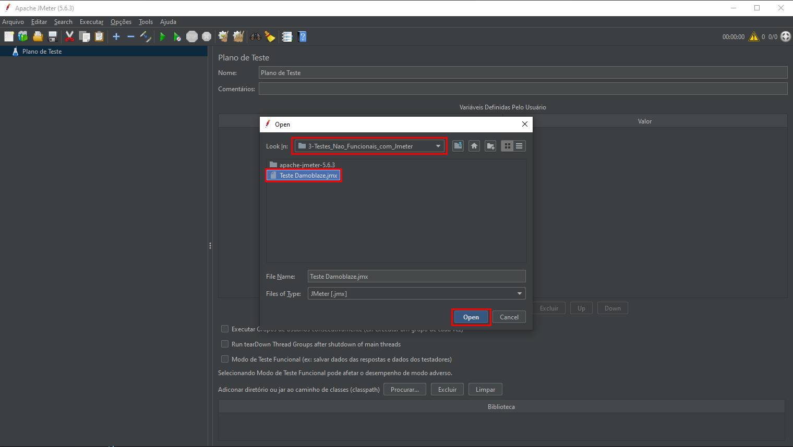
    
    7. Nesse projeto terá três testes disponíveis, conforme a figura abaixo, aconselho testar um de cada vez para ter resultados mais precisos.

    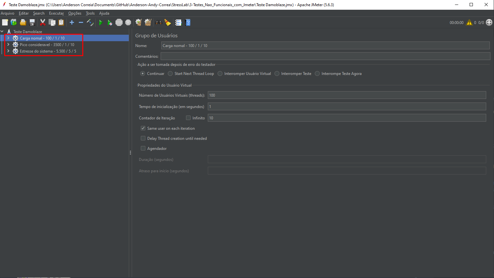

    8. Para iniciar um tesnte, selecione um dos itens, aperte com o botão direito e selecione start.

    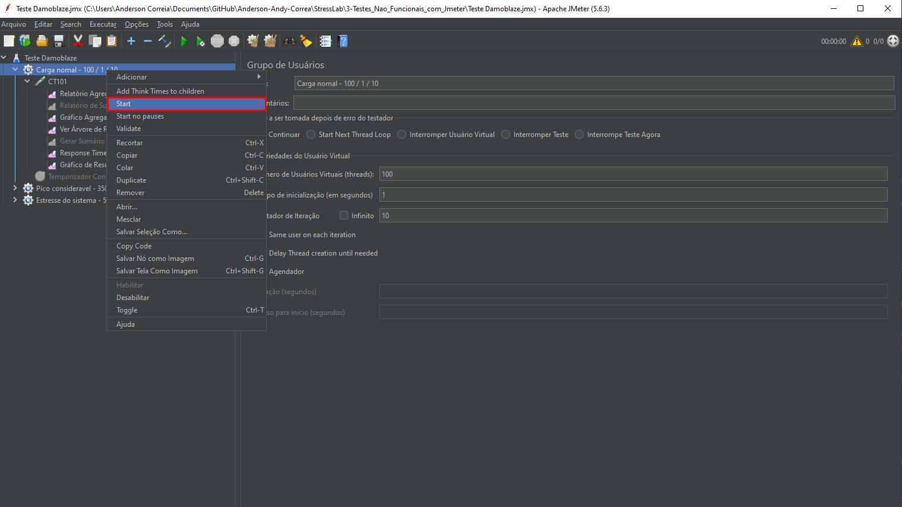

    9. Por fim, para visualizar os resultados, até mesmo durante o teste, abra a selação do teste em questão. Dentro vai ter um outro item de requisição, abra-o também que irá mostrar os tipos de visualizadores de teste. Recomendo escolher o Relatório Agregado, pois irá demosntrar mais informações nesse tipo de teste.

    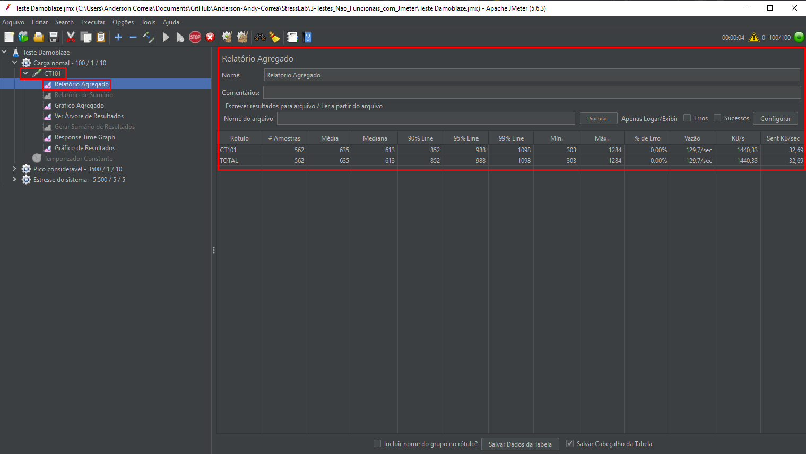

 

---

# 📘 Documentação

Para mais informações do projeto (desafio proposto, resolução, análise dos cenários, ideias de modificação, entre outros fatores) verifique o [relatório](./5-Documentacao_e_Relatorio_final/A3%20-%20Gestão%20e%20qualidade%20de%20software.pdf) oficial do projeto.

Caso tenha alguma sugestão, correção ou sugestão de melhorias, por favor entre em contato. 😊

 

---

# 👨‍💻 Colaboradores

<table>
    <tr>
        <td align=center>
            <a href="https://github.com/Sttarnix">
                 
                Aiara Dorneles Claudio
            </a>
        </td>
        <td align=center>
            <a href="https://github.com/Anderson-Andy-Correa">
                 
                Anderson Corrêa
            </a>
        </td>
        <td align=center>
            <a href="https://github.com/AndreLoppnow">
                 
                André Felippe Loppnow
            </a>
        </td>
        <td align=center>
            <a href="https://github.com/gabrielpoleza">
                 
                Gabriel Faustino Poleza
            </a>
        </td>
        <td align=center>
            <a href="https://github.com/2005LucasLongo">
                 
                Lucas Longo
            </a>
        </td>
    </tr>
</table>

 

---

# 👨‍🎓 Professor / Orientador

<table>
    <tr>
        <td align=center>
            <a href="https://github.com/RandMelville">
                 
                Randerson Melville
            </a>
        </td>
    </tr>
</table>
